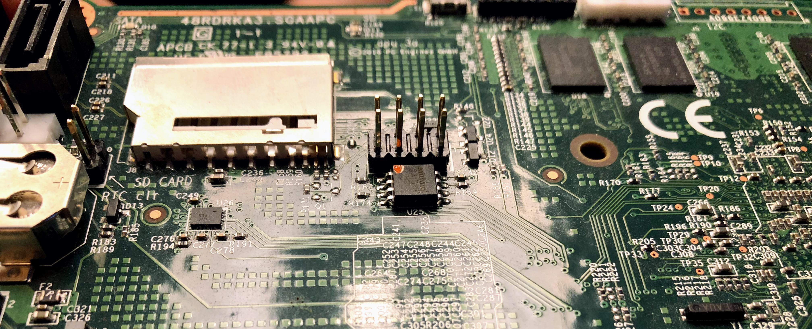

# BIOS firmware

**B**asic **I**nput **O**utput System ist an old term before the 21th century. The BIOS was used to initialize the hardware and bring it to working state for the operating system. Nowadays it is called firmware as a generalized description. There are different kinds of firmware, you can find many listed on the [Open Source Firmware Conference ](https://www.osfc.io)homepage.

The firmware has the following important tasks:

* UART initialization \(debugging purpose\)
* Cache as RAM/SRAM initialization during early boot stage
* System memory training and memory cache setup
* If system memory is up an running:
  * PCI device enumeration and resource allocation
  * ACPI Tables
  * Native graphics
  * Drivers
* Launch of the bootloader \(implementation\)
* and more..

You can find more information how this technology stack works by watching this [Open Source Firmware video](https://www.youtube.com/watch?v=xfqKm190dbU) on youtube.

### What has the firmware todo with system transparency?

Normally the world of firmware is a place of legacy software development and documentation is only available under NDAs. The amount of firmware grows nowadays up to 128MB NOR flash capacity which makes firmware more vulnerable in terms of code size. Firmware is also the initial root of trust of the most systems. If firmware is tampered the whole system is insecure and hard to recover back to a secure state.

System Transparency requires firmware to be much as open-source as possible in order to make the core root of trust transparent. It has the following firmware requirements:

* Firmware must be open-source, publicly available and redistributable.
* Firmware must be build reproducible from source code.
* Firmware must support secure updates and failure-safety.
* Firmware must be able to securely load a Linux kernel + initrd as bootloader.
* Firmware must measure every loaded code/data before execution:
  * A trust anchor like a Trusted Platform Module or similar technology is required.
  * Measurements must be stored securely in the trust anchor.
* Firmware must protect the core root of trust against modification.
* If the firmware needs to call blobs which can't be open-source:
  * The blobs must be redistributable.
  * The blobs must be publicly available.
  * The blobs should provide the absolut minimum of functionality.

If you are trying to run system transparency on systems which aren't matching all requirements. Be aware that there can be security implications. Even so, it is possible to run system transparency on closed-source firmware.

### What kind of firmware projects are supported by System Transparency?

At the moment the only supported firmware is [coreboot](https://www.coreboot.org) on x86 platforms. coreboot meets all requirements above. If you want to try out coreboot for system transparency on modern/cheap server platforms, try [supermicro systems listed here.](https://doc.coreboot.org/mainboard/supermicro/x11-lga1151-series/x11-lga1151-series.html)

