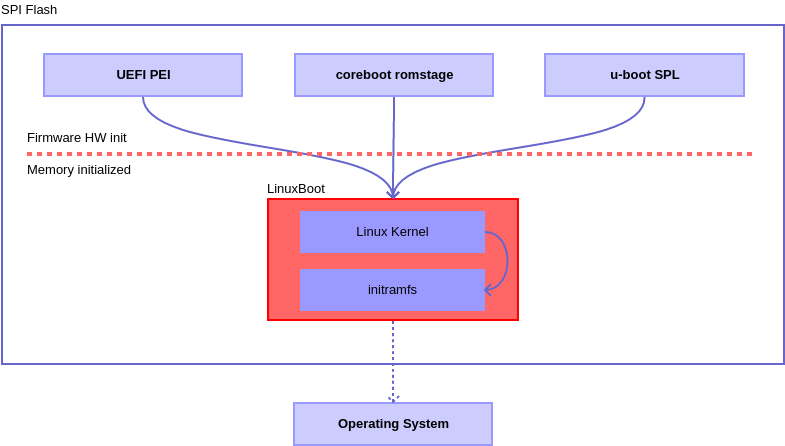

# Bootloader

The [LinuxBoot](https://www.linuxboot.org) project provides tooling and a bootloader implementation as initramfs in Golang. In combination with the Linux kernel, the bootloader moves from a standalone implementation to a fully featured Linux environment. The development happens not in a firmware environment anymore.

LinuxBoot has the following advantages over the most bootloader implementations:

* Best driver support for all kinds of hardware through the [Linux kernel.](https://kernel.org)
* Improved software development efficiency by using [Golang](https://www.golang.org) and a fully featured Linux userspace.
* Tons of Linux developers solving the human resource issue for firmware.
* Modern software development pratices and programming languages available.

### What has the bootloader todo with system transparency?

System Transparency has its reference implementation as part of the LinuxBoot bootloader in the [u-root project.](https://github.com/u-root/u-root/tree/stboot) After the firmware is loaded, the bootloader is invoked:

